# Funk drummer

An animated drummer character in a single, self-contained SVG file. No images, fonts, or scripts are needed.

## Files

- `funk_drummer.svg` is the character. It plays a looping 2-bar routine at 120 BPM.
- `preview.html` lets you watch him, with play/pause and a BPM control. Open it in a browser.
- `pose_sheet.png` shows six key poses from the loop.

## Using it on your site

The simplest way is an image tag:

    

To control him from game code (pause on a miss, sync to your music), load it with `<object>` or paste the SVG inline, then use the Web Animations API:

    const anims = svgDocument.getAnimations();
    anims.forEach(a => a.pause());                  // freeze
    anims.forEach(a => a.play());                   // resume
    anims.forEach(a => a.playbackRate = bpm / 120); // match tempo

`preview.html` shows a working example of both.

## The loop (4 seconds = 2 bars at 120 BPM)

1. **Crash.** Big stretch, shades pop off his face, starburst.
2. **Shimmy groove.** Shoulder shimmy, syncopated kick, offbeat hi-hat.
3. **Shades peek.** Shades slide down his nose, eyes dart, eyebrows waggle.
4. **Stick toss.** Right stick spins into the air and is caught on the downbeat of bar 2.
5. **Fill.** Hands trade snare and floor tom, then slam together while he head-bangs and yells.
6. **Windup** into the next crash.

## Changing the tempo in the file itself

Replace every `4s` in the `<style>` block with `(480 / BPM)s`. For example, 100 BPM is `4.8s`.

Users with reduced motion turned on in their system settings see him in a still pose.
